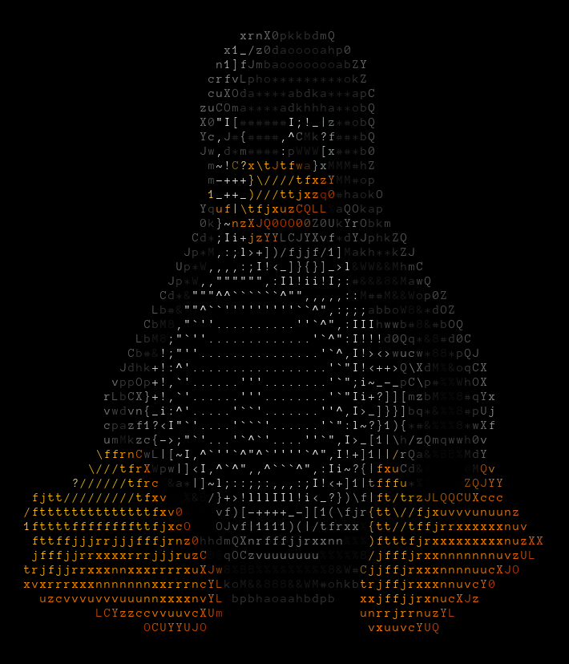

> NOTE: If you are interested for the Terminal version source code, it is in the ```Terminal``` branch. Else, if you looking for the GUI version source code (more up to date), it is  in the ```GUI``` branch.

# pic2ascii

### About Repo
The `pic2ascii` program (mostly writen in `Python 3`) takes any image and converts it in to text characters using the ascii system (working on unicode). Right now we are still in development, but we got most of the low level stuff down. We even added etxra things like multiprocessing into the GUI version. We are curently working on features that are important for the GUI to comunicate with the engine (core) of the program. 

The Terminal edition is done (the beta anyway), so we recomend you use that for now. However you can still use the GUI version if you prefer it over the Terminal as it has more features (like multiprocessing) than the terminal version.

Thank you for reading our notes! We hope you enjoy our program.

--ErMax.Inc Dec 31, 2021 -em-mw

here are some examples of what pic to ascii can do:

### An example (Genarated by pic2ascii GUI-commit b12628dc)

Original Image (before processed through the program):


Plain ASCII Text (Genarated from .txt output file):
```
$$$$$$$$$$$$$$$$$$$$$$$$$$$$$$$$$$$$$$$$$$$$$$$$$$$$$$$$$$$$$$$$$$$$$$$
$$$$$$$$$$$$$$$$$$$$$$$$$$$$$$$$$$$$$$$$$$$$$$$$$$$$$$$$$$$$$$$$$$$$$$$
$$$$$$$$$$$$$$$$$$$$$$$$$$$$$$xrnX0pkkbdmQ$$$$$$$$$$$$$$$$$$$$$$$$$$$$$
$$$$$$$$$$$$$$$$$$$$$$$$$$$$x1_/z0daooooahp0$$$$$$$$$$$$$$$$$$$$$$$$$$$
$$$$$$$$$$$$$$$$$$$$$$$$$$$n1]fJmbaoooooooabZY$$$$$$$$$$$$$$$$$$$$$$$$$
$$$$$$$$$$$$$$$$$$$$$$$$$$crfvLpho*********okZ$$$$$$$$$$$$$$$$$$$$$$$$$
$$$$$$$$$$$$$$$$$$$$$$$$$$cuXOda****abdka***apC$$$$$$$$$$$$$$$$$$$$$$$$
$$$$$$$$$$$$$$$$$$$$$$$$$zuCOma****adkhhha**obQ$$$$$$$$$$$$$$$$$$$$$$$$
$$$$$$$$$$$$$$$$$$$$$$$$$X0"I[######I;!_|z*#obQ$$$$$$$$$$$$$$$$$$$$$$$$
$$$$$$$$$$$$$$$$$$$$$$$$$Yc,J#{####,^CMk?f##*bQ$$$$$$$$$$$$$$$$$$$$$$$$
$$$$$$$$$$$$$$$$$$$$$$$$$Jw,d*m####:pWWW[x##*b0$$$$$$$$$$$$$$$$$$$$$$$$
$$$$$$$$$$$$$$$$$$$$$$$$$$m~!C?x\tJtfwa}xMMM#hZ$$$$$$$$$$$$$$$$$$$$$$$$
$$$$$$$$$$$$$$$$$$$$$$$$$$m-+++}\////tfxzYMM#op$$$$$$$$$$$$$$$$$$$$$$$$
$$$$$$$$$$$$$$$$$$$$$$$$$$1_++_)///ttjxzq0#haokO$$$$$$$$$$$$$$$$$$$$$$$
$$$$$$$$$$$$$$$$$$$$$$$$$Yquf|\tfjxuzCQLL%aQOkap$$$$$$$$$$$$$$$$$$$$$$$
$$$$$$$$$$$$$$$$$$$$$$$$$0k}~nzXJQ0OO00Z0UkYrObkm$$$$$$$$$$$$$$$$$$$$$$
$$$$$$$$$$$$$$$$$$$$$$$$Cd*;Ii+jzYYLCJYXvf*dYJphkZQ$$$$$$$$$$$$$$$$$$$$
$$$$$$$$$$$$$$$$$$$$$$$Jp*M,:;l>+])/fjjf/1]Makh**kZJ$$$$$$$$$$$$$$$$$$$
$$$$$$$$$$$$$$$$$$$$$$Up*W,,,,:;I!<_]}{}]_>l&WW&&MhmC$$$$$$$$$$$$$$$$$$
$$$$$$$$$$$$$$$$$$$$$Jp*W,,"""""",:Il!ii!I;:#&&&8&MawQ$$$$$$$$$$$$$$$$$
$$$$$$$$$$$$$$$$$$$$Cd*&"""^^``````^"",,,,,::M##M&&Wop0Z$$$$$$$$$$$$$$$
$$$$$$$$$$$$$$$$$$$Lb#&""^``'''''''''``^",:;;;abboW8&*dOZ$$$$$$$$$$$$$$
$$$$$$$$$$$$$$$$$$CbM8,"`''..........''`^",:IIIhwwb#8&#bOQ$$$$$$$$$$$$$
$$$$$$$$$$$$$$$$$LbM8;"`''.............'`^":I!!!d0Qq*&8#d0C$$$$$$$$$$$$
$$$$$$$$$$$$$$$$Cb#&!;"''...............'`^,I!><>wucw*88*pQJ$$$$$$$$$$$
$$$$$$$$$$$$$$$Jdhk+!:^'.................'`"I!<++>Q\XdM%&oqCX$$$$$$$$$$
$$$$$$$$$$$$$$vppOp+!,`'......'''........'`";i~_-_pC\p#%%WhOX$$$$$$$$$$
$$$$$$$$$$$$$rLbCX}+!,`'......'''........'`"Ii+?]][mzbM%%8#qYx$$$$$$$$$
$$$$$$$$$$$$$vwdvn{_i:^'.....'``'.......''^,I>_]}}]bq*&%%8#pUj$$$$$$$$$
$$$$$$$$$$$$$cpazf1?<I"`'....'```'......'`":l~?}1){*#&%%%8*wXf$$$$$$$$$
$$$$$$$$$$$$$umMkzc{->;"`'...'`^`'....''`",I>_[1|\h/zQmqwwh0v$$$$$$$$$$
$$$$$$$$$$$$\ffrnCwL|[~I,^`''`^"^`''''`^",I!+]1||/rQa&%BB%MdY$$$$$$$$$$
$$$$$$$$$$$\///tfrXWpw|]<I,^`^",,^```^",:Ii~?{|fxuCd&@$$$$@MQv$$$$$$$$$
$$$$$$$$$?//////tfrc$&a*|]~l;::;;:,,,:;I!<+]1|tfffu*%$$$$$ZQJYY$$$$$$$$
$$$$fjtt/////////tfxv$$%&B/}+>!lllIIl!i<_?})\f|ft/trzJLQQCUXccc$$$$$$$$
$$$/fttttttttttttttfxv0$$$$vf)[-++++_-][1(\fjr{tt\//fjxuvvvunuunz$$$$$$
$$$1fttttffffffffttfjxcO$$$OJvf|1111)(|/tfrxx%{tt//tffjrrxxxxxxnuv$$$$$
$$$$fttffjjjrrjjjfffjrnz0hhdmQXnrfffjjrxxnn%%%)ftttfjrxxxxxxxxxnuzXX$$$
$$$$jfffjjrrxxxxrrrjjjruzCB@qOCzvuuuuuuu%%%%%8/jfffjrxxnnnnnnnuvzUL$$$$
$$$trjfjjrrxxxnnxxxrrrrxuXJw8%BB%%%%%%%%%8&W#CjjffjrxxxnnnnuucXJO$$$$$$
$$$xvxrrrxxxnnnnnnnxxrrrncYLkoM&&888&&WM#ohkbtrjffjrxxxnnuvcY0$$$$$$$$$
$$$$$uzcvvvuvvvuuunnxxxxnvYL$bpbhaoaahbdpb$$$xxjffjjrxnucXJz$$$$$$$$$$$
$$$$$$$$$$$$LCYzzccvvuuvcXUm$$$$$$$$$$$$$$$$$unrrjrrnuzYL$$$$$$$$$$$$$$
$$$$$$$$$$$$$$$$$$OCUYYUJO$$$$$$$$$$$$$$$$$$$$vxuuvcYUQ$$$$$$$$$$$$$$$$
$$$$$$$$$$$$$$$$$$$$$$$$$$$$$$$$$$$$$$$$$$$$$$$$$$$$$$$$$$$$$$$$$$$$$$$
$$$$$$$$$$$$$$$$$$$$$$$$$$$$$$$$$$$$$$$$$$$$$$$$$$$$$$$$$$$$$$$$$$$$$$$
```


ASCII with color (only in picture format):



credit: https://commons.wikimedia.org/wiki/File:Tux_Enhanced.svg
## All Remotes:
> * GitLab: https://gitlab.com/ermax-inc/pic2ascii
