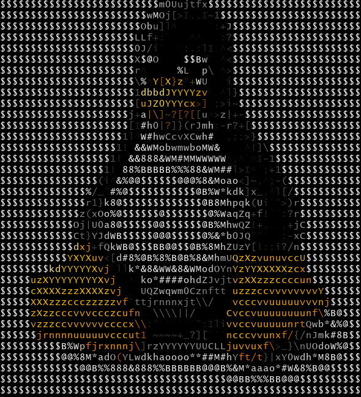

> NOTE: If you are interested for the Terminal version (more up to date) source code, it is in the ```Terminal``` branch. Else, if you looking for the GUI version source code, it is  in the ```GUI``` branch.

# pic2ascii

### About Repo
The `pic2ascii` (mostly coded in `Python 3`) program converts any JPEG image and converts it in to text characters (A.K.A ASCII).
Right now we are still in development but we got most of the low level stuff down so you can use the program. We are curently working on features like adding 'About' menus and adding features like 'Report a bug'. 

The Terminal edition is closer to being done, so we recomend you use that for now, but you can still use the GUI version if you prefer it over the Terminal.


### An example (Genarated by pic2ascii Terminal-commit 91189c7c)


Plain ASCII Text (Genarated from .txt output file):
```
$$$$$$$$$$$$$$$$$$$$$$$$$$m0Uujtfx$$$$$$$$$$$$$$$$$$$$$$$$$
$$$$$$$$$$$$$$$$$$$$$$$$wMOj[>I,,I~1$$$$$$$$$$$$$$$$$$$$$$$
$$$$$$$$$$$$$$$$$$$$$$$Obu]l^.    ':+J$$$$$$$$$$$$$$$$$$$$$
$$$$$$$$$$$$$$$$$$$$$$LLf+:'  .^^. .:?$$$$$$$$$$$$$$$$$$$$$
$$$$$$$$$$$$$$$$$$$$$$0J/i'  `;,:lI.^<$$$$$$$$$$$$$$$$$$$$$
$$$$$$$$$$$$$$$$$$$$$$X$@O.   $$Bw'.^<$$$$$$$$$$$$$$$$$$$$$
$$$$$$$$$$$$$$$$$$$$$$r^.    %L  p\ ^>$$$$$$$$$$$$$$$$$$$$$
$$$$$$$$$$$$$$$$$$$$$$\%^Y[X}z"+WU  `i$$$$$$$$$$$$$$$$$$$$$
$$$$$$$$$$$$$$$$$$$$$$1dbbdJYYYYzv .^l}$$$$$$$$$$$$$$$$$$$$
$$$$$$$$$$$$$$$$$$$$$$[uJZ0YYYcx>]`;>i~$$$$$$$$$$$$$$$$$$$$
$$$$$$$$$$$$$$$$$$$$$j+a|\]~?[?[[u^>z|+-$$$$$$$$$$$$$$$$$$$
$$$$$$$$$$$$$$$$$$$$$[I#h0|?]}(rJmh:-r?+[$$$$$$$$$$$$$$$$$$
$$$$$$$$$$$$$$$$$$$$1l^W#hwCcvXCwh# `,;;>}$$$$$$$$$$$$$$$$$
$$$$$$$$$$$$$$$$$$$1!`&&WMobwmwboMW&  ..^!]\$$$$$$$$$$$$$$$
$$$$$$$$$$$$$$$$$$1!`&&888&WM#MMWWWWW^,^'^I-1$$$$$$$$$$$$$$
$$$$$$$$$$$$$$$$$1!`88%BBBBB%%%88&WM##l>I^`;+1$$$$$$$$$$$$$
$$$$$$$$$$$$$$$$(i^&%@@$$$$$$@@@%8&Moao<]~,^;-($$$$$$$$$$$$
$$$$$$$$$$$$$$%/_"#%@$$$$$$$$$$$@B%W*kdk]x_,^l[/$$$$$$$$$$$
$$$$$$$$$$$$$$r1}k8@$$$$$$$$$$$$$@B8Mhpqk(Ui`">)r$$$$$$$$$$
$$$$$$$$$$$$$z(xOo%@$$$$$$@$$$$$$$@%WaqZq+f!`':?r$$$$$$$$$$
$$$$$$$$$$$$Oj|U0a8@$$$$$@@$$$$$$@B%MhwQZ!+,..,+jC$$$$$$$$$
$$$$$$$$$$$$Ct}YJdWB$$$$$@@@$$$$$@%&*b0JQ""' .:-xC$$$$$$$$$
$$$$$$$$$$$$dxj+fQkWB@$$$BB@@$$@B%8MhZUzY[!:;i?/n$$$$$$$$$$
$$$$$$$$$$$YXYXuv<[d#8%@B%8%B@B%8&MhmUQzXzvunuvccU$$$$$$$$$
$$$$$$$$kdYYYYYXvj'llk*&8&WW&8&WModOYnYzYYXXXXXzcx$$$$$$$$$
$$$$$uzXYYYYYYYYXvj .^ ko*####ohdZJvjtvzXXzzzccccun$$$$$$$$
$$$$$cXXXXzzzXXXXzvj.  UQZwqwm0Cznftt uzzzccvvvvvvvvY$$$$$$
$$$$$XXXzzzccczzzzzvf"ttjrnnnxjt\\/   vcccvvuuuuuvvvnj$$$$$
$$$$$zXzzcccvvvccczcufn`.\\\\||/  ..`Cvccvuuuuuuuunf\%B@$$$
$$$$$vzzzccvvvvvvccccx\\:"`''''`":IlivvccvuuuuunrtQwb*&%@$$
$$$$$$jrnnnnuuuuuvcccut1.~~~~+_?]['''ncccvvunxf/{/nJmk#8B$$
$$$$$$$$$$B%Wpfjrxnnnj\]rzYYYYYYUUCLLjuvvuxf\>_}\nUOdoW%@$$
$$$$$$$$$$@@%8M*adO(YLwdkhaoooo**##M#hYft/t}|xY0wdh*M8B@$$$
$$$$$$$$$$$$$@@B%%888&888%%BBBBBB@@@B%&M*aaao*#W&8%B@@$$$$$
$$$$$$$$$$$$$$$$$$$$$$$$$$$$$$$$$$$$$@@BB%%%BB@@@$$$$$$$$$$
$$$$$$$$$$$$$$$$$$$$$$$$$$$$$$$$$$$$$$$$$$$$$$$$$$$$$$$$$$$
```


ASCII with color (only in picture format):



## All Remotes:
> * GitHub: https://github.com/ErMax-Inc/pic2ascii * GitLab: https://gitlab.com/ermax-inc/pic2ascii
